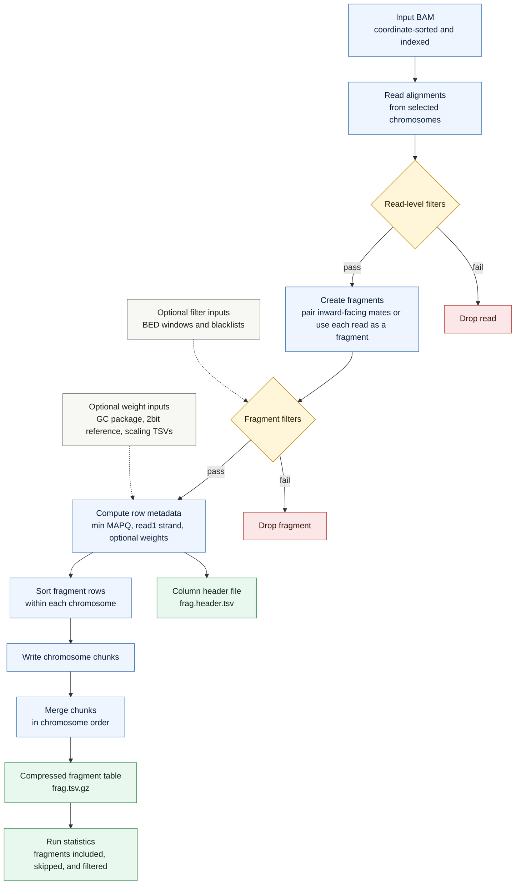

# `cfdna bam-to-frag`

Convert a BAM file into a compressed fragment table. Each output row represents one fragment, with optional correction weights written as extra columns and described by a companion header file.

## Pipeline

## Fragment Rows

The base columns are chromosome, start, end, minimum MAPQ, and read1 strand. For paired-end input, start and end come from the inward-facing fragment span. In `--reads-are-fragments` mode, each accepted read becomes one fragment row.

## Optional Metadata

When requested, `bam-to-frag` adds GC correction weights, coverage-scaling weights, and fragment-count-scaling weights as extra columns. The companion `frag.header.tsv` file records the exact column names so downstream commands can restore the metadata.
