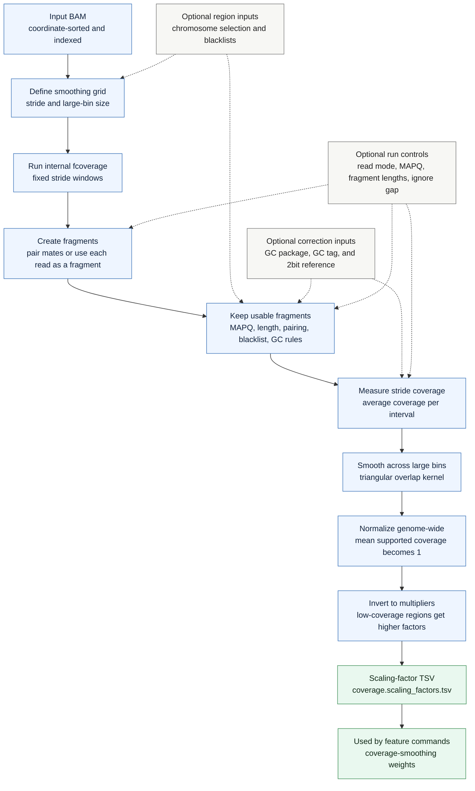

# `cfdna coverage-weights`

Build genomic scaling factors that normalize large-scale coverage variation. The command measures average fragment coverage in stride bins, smooths it across larger bins, and writes multiplicative factors for downstream coverage-like features.

## Pipeline

## Coverage Model

`coverage-weights` uses the same fragment creation and filtering behavior as `fcoverage`. In paired-end mode, coverage is based on the fragment span from the forward read position to the reverse read reference end. In `--reads-are-fragments` mode, each accepted read is counted as its own fragment.

By default, paired fragments cover the full inter-mate span. With `--ignore-gap`, uncovered sequence between non-overlapping mates is excluded, matching downstream `fcoverage --ignore-gap` analyses.

## Smoothing Model

The command first measures average coverage in fixed stride bins. It then applies a triangular overlap kernel derived from `--bin-size` and `--stride`, so each stride row reflects neighboring large-bin support.

After smoothing, supported rows are normalized to a genome-wide mean of 1 and inverted. Downstream commands multiply coverage-like features by these factors to reduce large-scale coverage variation.

## Output

The output is `<prefix>.coverage.scaling_factors.tsv`, or `coverage.scaling_factors.tsv` when no prefix is set. The TSV includes stride coordinates, raw stride average coverage, smoothed coverage, the multiplicative scaling factor, and metadata describing whether GC correction and inter-mate gap exclusion were used while building the weights.
