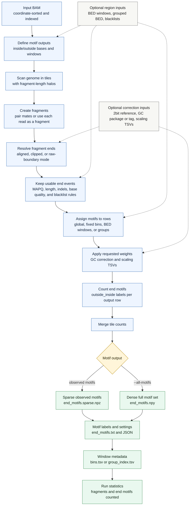

# `cfdna ends`

Count fragment end motifs from a BAM file. The command extracts bases just outside and inside each fragment end, orients the motif consistently, and writes motif counts per genome window or group.

## Pipeline

## Motif Model

For each kept fragment end, `ends` combines the requested outside-reference bases with the requested inside-fragment bases. Inside bases can come from the reads or from the reference. Right-end motifs are reverse-complemented so both ends use the same fragment-end-inward 5' to 3' orientation. Motif labels are written as `<outside>_<inside>`.

## Window Model

Without windowing, all counted motifs go into one global row. With fixed bins or BED windows, rows represent genomic intervals. With grouped BED input, rows represent group names, and windows with the same group are aggregated.

The default assignment counts each motif in the row containing its endpoint. Other modes can assign both end motifs by fragment overlap, midpoint, or overlap proportion.

## Outputs

By default, the command writes only observed motif columns in a sparse `.npz` matrix. With `--all-motifs`, it writes a dense `.npy` matrix containing every possible motif for the selected inside/outside lengths. The motif label file and settings JSON describe how to interpret the matrix, while `bins.tsv` or `group_index.tsv` describes the output rows when windowing is used.
