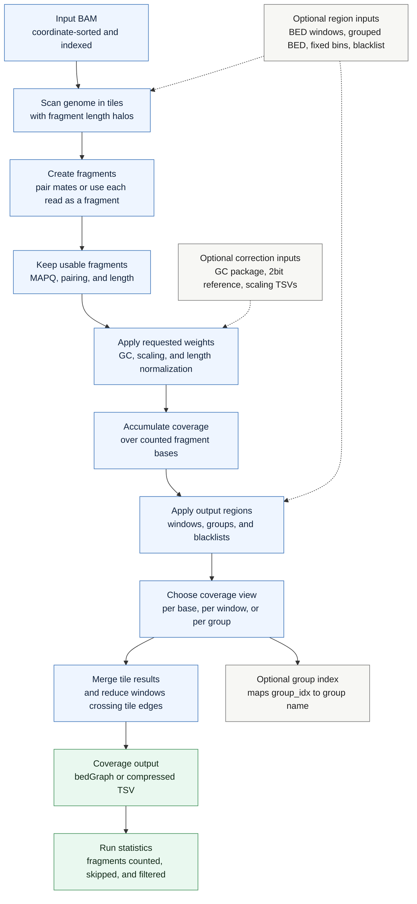

# `cfdna fcoverage`

Compute fragment coverage from a BAM file. The command turns alignments into fragments, counts their covered bases, and writes either positional coverage or window-level summaries.

## Pipeline

## Fragment Coverage Model

For paired-end BAM input, `fcoverage` builds one fragment from inward-facing mates and counts coverage across the fragment span. In `--reads-are-fragments` mode, each accepted read is counted as its own fragment. When gap-aware counting is enabled, deleted or skipped reference regions can be excluded from the counted bases.

## Output Views

Without windowing, the command writes per-position bedGraph coverage. With `--by-size` or `--by-bed`, it writes one compressed TSV row per window. With `--by-grouped-bed`, windows are reduced to group-level rows and a group-index TSV records the group names. BED mode can also write positional coverage restricted to the selected windows.

## Corrections And Weights

Optional GC correction, genome scaling, and length normalization modify each fragment's contribution before coverage is accumulated. Blacklists remove masked bases from window denominators and summary statistics while preserving their counts in aggregate outputs.
