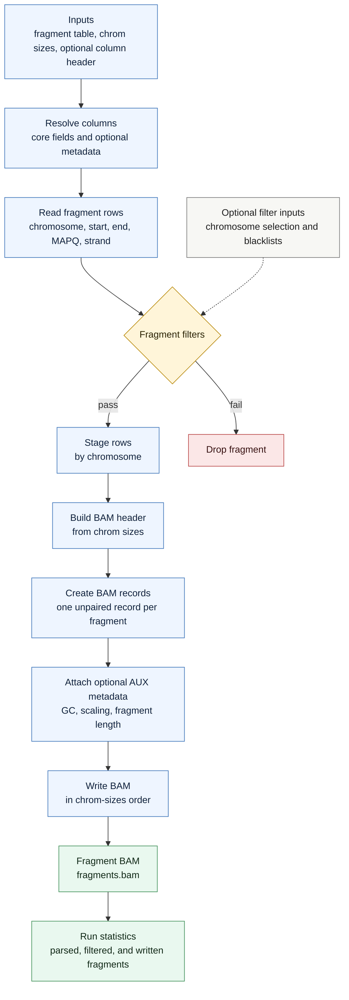

# `cfdna frag-to-bam`

Convert a fragment table back into a BAM file. Each accepted frag row becomes one unpaired BAM record spanning the full fragment interval.

## Pipeline

## BAM Records

The output BAM contains one unpaired record per surviving fragment. The record starts at the frag `start`, ends at the frag `end`, uses a full-length match CIGAR, and stores the frag MAPQ and strand.

## Optional Metadata

If column names are available from an inline header, explicit header file, or companion `frag.header.tsv`, recognized extra columns are transferred to BAM AUX metadata. Headerless five-column files are also accepted when no extra metadata needs to be restored.
