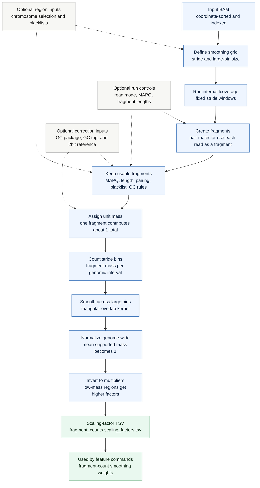

# `cfdna fragment-count-weights`

Build genomic scaling factors that normalize large-scale fragment-count variation. The command counts unit fragment mass in stride bins, smooths that mass across larger bins, and writes multiplicative factors for downstream count-like features.

## Pipeline

## Fragment-Mass Model

`fragment-count-weights` uses the same fragment creation and filtering behavior as `fcoverage`, but it counts in unit-mass mode. A fragment contributes approximately one total unit of mass, split across the stride bins covered by its span.

This differs from `coverage-weights`, where long fragments naturally contribute more total coverage because they cover more bases.

## Smoothing Model

The command first counts fragment mass in fixed stride bins. It then applies a triangular overlap kernel derived from `--bin-size` and `--stride`, so each stride row represents smoothed support from neighboring large bins.

After smoothing, supported rows are normalized to a genome-wide mean of 1 and inverted. Downstream commands multiply fragment counts by these factors to reduce large-scale count variation.

## Output

The output is `<prefix>.fragment_counts.scaling_factors.tsv`, or `fragment_counts.scaling_factors.tsv` when no prefix is set. The TSV includes stride coordinates, raw stride fragment mass, smoothed fragment mass, the multiplicative scaling factor, and metadata describing whether GC correction was used while building the weights.
