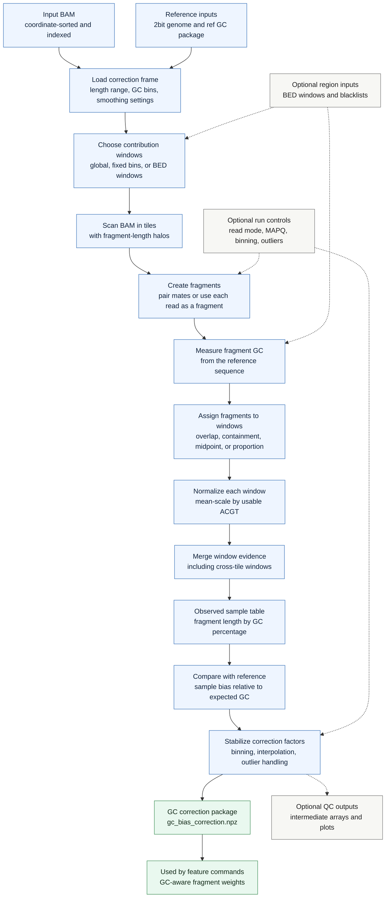

# `cfdna gc-bias`

Fit a sample-specific GC correction package from a BAM file. The command measures the sample's observed fragment GC distribution, compares it with a reusable reference GC package, and writes correction factors for downstream feature commands.

## Pipeline

## Correction Model

The reference GC package defines the expected fragment distribution for a genome setup: fragment lengths by GC percentage, plus the support masks and smoothing choices created by `cfdna ref-gc-bias`.

`gc-bias` measures the same length-by-GC table from the sample BAM. Fragments are counted in genomic windows so local coverage variation can be normalized before the command estimates the global sample GC profile.

## Window Model

With `--global`, all accepted fragments contribute to one sample-wide table. With fixed-size or BED windows, each window is normalized separately and then merged into the final observed table. Window assignment can count overlap proportionally, require any or all overlap, use the fragment midpoint, or require a minimum fragment-overlap proportion.

Blacklists remove problematic reference bases before fragment GC and window-normalization support are computed.

## Output

The main output is `<prefix>.gc_bias_correction.npz`, or `gc_bias_correction.npz` when no prefix is set. The package contains the correction matrix and metadata needed by downstream commands that apply GC-aware fragment weights. When requested, the command also writes intermediate arrays and QC plots for inspecting the fitted correction surface.
