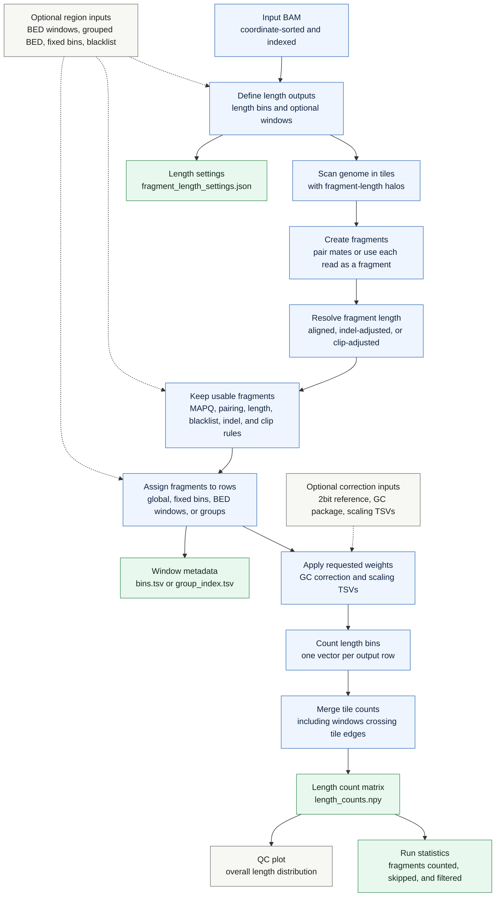

# `cfdna lengths`

Count fragment length distributions from a BAM file. The command turns alignments into fragments, assigns each kept fragment to output rows, and writes a length-count matrix that can be loaded directly in NumPy.

## Pipeline

## Length Model

For paired-end BAM input, `lengths` builds fragments from inward-facing mates and uses the fragment span from the forward read position to the reverse read reference end. In `--reads-are-fragments` mode, each accepted read is treated as its own fragment.

The counted length can be the aligned fragment length, an indel-adjusted length, or a clip-adjusted length. Length bins are half-open intervals, and each accepted fragment contributes to the bin containing its resolved length.

## Window Model

Without windowing, all counted fragments go into one global row. With fixed bins or BED windows, rows represent genomic intervals. With grouped BED input, rows represent group names, and windows with the same group are aggregated.

The default assignment counts a fragment in every overlapping row. Other assignment modes can require full containment, use the fragment midpoint, or weight rows by overlap proportion.

## Outputs

The main output is `<prefix>.length_counts.npy`, with one row per output bin or group and one column per length bin. The settings JSON records the length-bin and counting configuration. Windowed runs also write `bins.tsv` or `group_index.tsv` so matrix rows can be mapped back to genomic intervals or group names. When plotting is enabled, the command also writes an overall length-distribution PNG.
