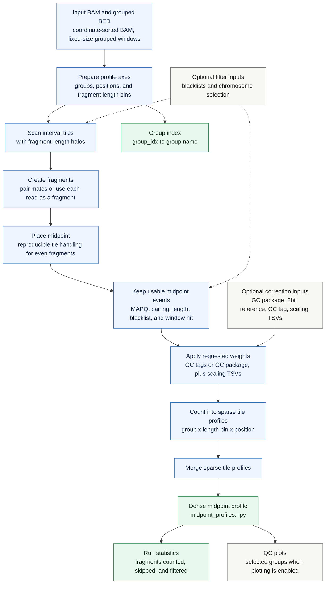

# `cfdna midpoints`

Build grouped midpoint profiles from a BAM file. The command counts fragment midpoints inside grouped windows and writes a profile tensor that can be loaded directly in NumPy.

## Pipeline

## Profile Model

Each grouped BED row contributes a fixed-width window. Windows with the same group name are collapsed into one profile, so the final array is shaped `(group, length_bin, position)`. Fragment length bins come from `--length-bins`, and each accepted fragment contributes to the bin containing its fragment length.

## Midpoint Placement

For odd-length fragments, the midpoint is the center base. For even-length fragments, the command reproducibly assigns the midpoint to one of the two central bases so the profile does not always round ties in the same direction.

## Outputs

The main output is `<prefix>.midpoint_profiles.npy`. The companion `<prefix>.group_index.tsv` maps numeric group indices back to group names. When plotting is enabled, selected groups also produce quick-look PNG profiles and length-bin heatmaps.

## Corrections And Filters

Optional blacklists remove fragments before counting. Optional GC correction and genome scaling change each midpoint's count weight before it is added to the profile.
