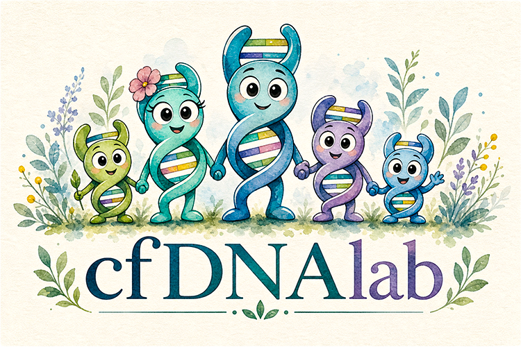
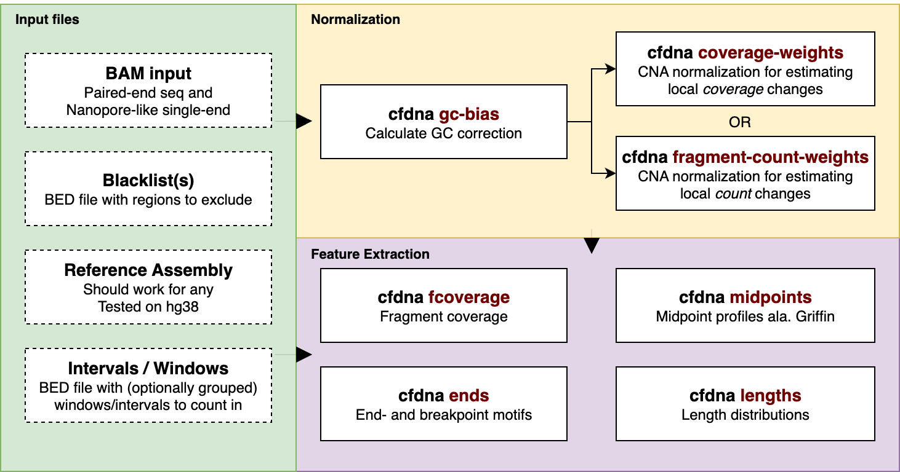

<br>

<p align="center">
  
</p>

<br>

<p align="center">
  <a href="https://github.com/BesenbacherLab/cfDNAlab/actions/workflows/rust.yml"></a>
  <a href="https://codecov.io/gh/BesenbacherLab/cfDNAlab"></a>
  <a href="https://crates.io/crates/cfdnalab"></a>
  <a href="https://anaconda.org/bioconda/cfdnalab"></a>
  <a href="https://cfDNAlab.tools"></a>
  <a href="LICENSE"></a>
</p>

<br>

Ultra-fast command-line tools for analysis of cell-free DNA. Extract **fragment coverage**, **midpoint coverage**, **fragment end-motifs**, and **fragment lengths** across the whole genome or in windows in mere seconds or minutes. All commands integrate options for sample-specific GC correction and large-scale genomic smoothing.

Works on cfDNA **fragments** from either *paired-end* sequencing data or unpaired data where each read represents a full fragment. Written in Rust for *speed*.

The commands are **highly flexible** with many options and good default settings. Start with the simple [examples](#examples) in this README and then check the full guides in the [docs](https://cfdnalab.tools/).

Load the main outputs with the **accompanying [R](https://github.com/BesenbacherLab/cfDNAlab/tree/main/r-cfdnalab) and [Python](https://github.com/BesenbacherLab/cfDNAlab/tree/main/py-cfdnalab) packages** for easier downstream usage (*installed separately*).

**Workflow-safe outputs**: The output files are only moved to their final location once all files have been fully written, so workflow managers don't confuse partially written files as successful completion.

The package is under active development and may [change](https://github.com/BesenbacherLab/cfDNAlab/blob/main/CHANGELOG.md). Multiple additional commands are currently being built.
Suggest a tool or feature [here](https://github.com/BesenbacherLab/cfDNAlab/issues/new/choose)!

<br>

## Installation

You may need a few dependencies that can be installed as a conda environment with:

```bash
conda create -n cfdnalab rust=1.94.0 zstandard perl fontconfig conda-forge::llvmdev conda-forge::clangdev
conda activate cfdnalab
```

Compile and install:

```bash
# Install latest release
cargo install cfdnalab --locked
cfdna --help

# Latest development version
cargo install --git https://github.com/BesenbacherLab/cfDNAlab --locked
cfdna --help
```

<br>

## Quick start

Calculating positional fragment coverage across the genome is as easy as:

```bash
cfdna fcoverage \
  --bam <sample>.bam \
  --output-dir <sample_directory>/coverage \
  --output-prefix <sample_id>
```

Then, you can add blacklist filtering, GC correction and more. See the [examples](#examples) below or the website [guides](https://cfdnalab.tools/).

<br>

## Commands

The following commands are currently available:

`cfdna fcoverage`, `cfdna midpoints`, `cfdna ends`, `cfdna lengths`, `cfdna gc-bias`, `cfdna ref-gc-bias`, `cfdna fragment-count-weights`, `cfdna coverage-weights`, `cfdna bam-to-bam`, `cfdna bam-to-frag`, `cfdna frag-to-bam`.

<p align="center">
  
</p>  
<p align="center">
  <b>Figure 1</b>: Overview of the main commands and input files. Non-exhaustive.
</p>

### Feature extraction

Extract fragmentomics features:

<dl>
  <hr>
  <dt></dt>
  <dd>Count <i>fragment</i> coverage per position or aggregated in windows.</dd>
  
  <hr>

  <dt></dt>
  <dd>Count fragment <i>midpoint</i> coverage in fixed-size intervals, collapsed by groups across the genome.<br>E.g., transcription factor binding sites, aggregated per transcription factor.<br>Fast alternative to <a href=https://github.com/adoebley/Griffin>Griffin</a> when combined with <code>cfdna gc-bias</code>.</dd>

  <hr>

  <dt></dt>
  <dd>Count fragment end- and breakpoint-motifs.</dd>
  
  <hr>
  
  <dt></dt>
  <dd>Count fragment lengths.<br>In paired-end, the length is defined as <code>end(reverse) - start(forward)</code> for inwardly directed pairs only.</dd>
  <hr>
</dl>

### Normalization

Precompute GC-bias correction and genomic smoothing scaling factors:

<dl>
  <hr>
  <dt>, </dt>
  <dd>Calculate GC-bias for correcting a sample in the feature extraction commands.</dd>

  <hr>
  <dt></dt>
  <dd>Calculate fragment count-based scaling factors for normalizing/smoothing fragment counts across the genome.</dd>

  <hr>

  <dt></dt>
  <dd>Calculate fragment coverage-based scaling factors for normalizing/smoothing coverage across the genome.</dd>
  <hr>
</dl>

### Conversion

Convert BAM files to frag files, frag files to BAM files, and BAM files to tagged BAM files:

<dl>
  <hr>
  <dt></dt>
  <dd>Apply our filters and/or write GC correction and coverage weight tags to a BAM file.</dd>

  <hr>

  <dt></dt>
  <dd>Write fragment coordinates to a "frag" file (bed-like tsv file).</dd>

  <hr>

  <dt></dt>
  <dd>Convert fragment coordinates to a single-read unpaired BAM file.</dd>
  <hr>
</dl>

Planned: `cfdna fragment-kmers` (count kmers within fragments), `cfdna wps-peaks` (call windowed protection score peaks). Let us know what other fragmentomics features you would like to extract with `cfDNAlab`.

### Common command options

- **GC bias correction**: Perform GC bias correction by weighting the contribution of each fragment by its GC content.

- **Blacklist filtering**: Supply BED files with regions to exclude. The implementation is specific to each tool (filtering of full fragments or just the overlapping positions).

- **Windowing**: Perform the command in genomic windows. Either a single global window (default), windows specified in a BED file (optionally grouped), or via a fixed window size. Assign fragments to windows by how they overlap.

- **Genomic smoothing**: Scale the contribution of fragments by either their coverage or counts in megabase-scale overlapping bins. Useful when aggregating local, relative changes in coverage or counts where all genomic regions should contribute roughly the same. Reduces the effect of amplifications and deletions.

- **Unpaired data**: If you have Nanopore-sequenced cell-free DNA (or similar) where each read represents the full fragment, you can supply the `--reads-are-fragments` flag. This will consider each read a full fragment.

<br>

## FAQ

- How is *fragment* coverage for paired-end data different from the outputs of similar tools?
  - `fcoverage` first collects paired reads into **fragments** and then counts the coverage of the aligned bases and (optionally) the gap between mate reads.

- How do you define a "fragment" in paired-end sequencing data?
  - We define the *fragment* as the bases from the start of the forward read till the end of the reverse read (`[start(forward), end(reverse))`) for *inwardly directed* pairs only (i.e., where `start(forward) <= start(reverse)`), as suggested by Wang, H. et al. 2025. Some methods exclude deletions and skipped-regions. Some methods allow including soft-clipped bases.

  Fragment visualization:

  ```text
  Reference 5' >>>>>>>>>>>>>>> 3'
  Fragment     |-------------|
  Forward   5' |>>>>>>>| 3'     
  Reverse        3' |<<<<<<<<| 5' 
  ``` 

- How should I order the BAM files?
  - We expect BAM files to be *coordinate-sorted* and indexed.

- How do I run the command for unpaired data?
  - The commands accept `--reads-are-fragments`. Each read is then assumed to represent the full aligned fragment.

- How did you use LLMs (AI) in this project?
  - OpenAI's codex models were used for pair programming to speed up development and testing. Claude Code provided code reviews. All code for the released commands have been designed and validated by us.

<br>

## Examples

We aim for high flexibility to make the commands useful for both established and novel use cases. This leads to commands having many options. The following examples will get you quickly up and running with the most common cfDNA analyses. For more elaborate guides and command help pages, see the [docs](https://cfdnalab.tools/).

The final example is a full pipeline for running everything (but without the explanations from the separate examples).

**Assembly**: The below examples use filenames specific to the hg38 assembly, but any assembly (hg19 etc.) should work. Just be consistent, of course. Note that most commands use only the autosomes (`chr1-chr22`) by default (see `--chromosomes` in help files).

**Fragment length range**: The min/max fragment length range defaults to `30-1000bp`. Most commands specify this via `--min-fragment-length` and `--max-fragment-length`, while `lengths` and `midpoints` use `--length-bins`. We suggest keeping this range for the `ref-gc-bias` command. In the downstream feature extraction commands you can then narrow the range, if you want. For the scaling factors made with `fragment-count-weights` or `coverage-weights`, it's a trade-off whether to use the full range or an analysis-specific narrower range. The matching narrower range will make the genomic regions contribute more equally to the downstream features, while the full or a different range may better estimate copy number changes.

**Blacklist consistency**: When using blacklists to remove problematic regions of the genome, we recommend using them consistently in all commands. If you have sample-specific blacklists, reuse for all commands run on the same sample.

### Shared arguments

The following arguments are shared across *most* of the commands:

```bash

cfdna <command>
  --bam <sample>.bam \                          # Coordinate-sorted cfDNA BAM file
  --output-dir <path> \                         # Output directory
  --output-prefix <sample_id> \                 # Output filename prefix
  --n-threads <int> \                           # CPU threads
  --tile-size <int> \                           # Processing tile size (reduce for lower RAM)
  --reads-are-fragments \                       # Treat each read as one fragment
  --blacklist <path>/hg38-blacklist.v2.bed \    # BED intervals to exclude
  --blacklist <path>/<another_blacklist>.bed \  # Additional BED intervals to exclude
  --ref-2bit <path>/hg38.2bit \                 # Reference genome in 2bit format
  --min-fragment-length <int> \                 # Minimum fragment length
  --max-fragment-length <int> \                 # Maximum fragment length
  --length-bins <ints | start:stop:step> \      # OR fragment length bins (replaces min/max)
  --chromosomes chr1,chr2,chr3... \             # Chromosomes to include (default: chr1-chr22)
  --min-mapq <int> \                            # Minimum read mapping quality
  --by-size | --by-bed | --by-grouped-bed \     # Feature window definition (default: global)
  --gc-file | --gc-tag \                        # GC-bias correction source
  --scaling-factors <path> \                    # Scaling factors TSV for genomic smoothing
  --logging <string>                            # Logging mode: stdout, quiet, file

```

### GC correction pipeline

Fragmentomics features are vulnerable to biases from various sample-handling and sequencing processes, such as PCR amplification. `cfDNAlab` commands thus allow the correction of the commonly observed **GC-bias**.

This requires only a few steps:

1) Calculate the "expected" GC bias in the reference genome assembly (e.g., hg38). This can be **reused for all samples** aligned to that assembly:

```bash

cfdna ref-gc-bias --help

# Run once per assembly
cfdna ref-gc-bias \
  --ref-2bit <path>/hg38.2bit \
  --output-dir <ref_gc_directory> \
  --output-prefix hg38 \
  --n-threads 12 \
  --blacklist <path>/hg38-blacklist.v2.bed

```

2) Calculate the GC-bias correction factors per sample:

```bash

cfdna gc-bias --help

cfdna gc-bias \
  --bam <sample>.bam \
  --output-dir <sample_directory>/gc_bias \
  --n-threads 12 \
  --ref-2bit <path>/hg38.2bit \
  --ref-gc-file <ref_gc_directory>/hg38.ref_gc_package.zarr \
  --blacklist <path>/hg38-blacklist.v2.bed  # Should match those specified in ref-gc-bias!

```

3) Provide the correction factors when running the feature extraction commands **on the same BAM file**:

```bash

cfdna fcoverage \
  --bam <sample>.bam \
  ... \  # See fcoverage example
  --gc-file <sample_directory>/gc_bias/gc_bias_correction.zarr \
  --ref-2bit <path>/hg38.2bit

```

If you prefer a different/custom GC-bias tool, the feature extraction commands also accept reading a GC weight (how much a fragment should contribute) from an aux tag in the BAM file:

```bash

cfdna fcoverage \
  --bam <sample>.bam \
  ... \  # See fcoverage example
  --gc-tag 'GC'

```

### Genomic smoothing pipeline

For some commands, like `cfdna midpoints`, where we investigate **local changes** in the fragment distribution, we often want all non-blacklisted genomic regions to contribute roughly the same fragment mass to the features. We refer to this scaling of genomic regions as **genomic smoothing**. 

We use **fragment mass** as a common quantity for fragment counts and fragment coverage:

- `cfdna coverage-weights` uses length-weighted mass. Each covered position receives `1.0`, so longer fragments contribute more total mass because they cover more bases.
- `cfdna fragment-count-weights` uses unit fragment mass. Each covered position receives roughly `1.0 / fragment_length`, so each fragment contributes about `1.0` total mass regardless of length.

**Simplified**, the genomic smoothing can be achieved by calculating the fragment mass in a kilo/megabase resolution and dividing the contribution of each fragment (`1.0` or the GC-weight) by the normalized average mass in its context.

**More detailed**, the smoothing weight commands build a smoothed normalization map using a sliding window:

**A**) They split the genome into "stride-bins" (default: 500kb) and measure fragment mass in each bin.
`coverage-weights` writes this as average coverage per stride, while `fragment-count-weights` writes total unit fragment mass per stride.

**B**) They smooth each bin with a triangular weighting kernel, that weights the fragment mass of the neighbouring stride-bins by how many overlapping megabins (default: 5Mb) they are part of. E.g.:

Using a megabin-size of `6` and stride size of `2` for demonstrational purposes:

**Stride bins** (fixed along genome, each with a stride-level fragment-mass value):

`[A] [B] [C] [D] [E] [F] [G] ...`

**Overlapping megabins** (`MB*`) each cover 3 stride-bins.
**`W_D`** weights each stride-bin by how many `D`-overlapping megabins it is part of.
Stride-bin `B` is only part of one megabin that overlaps `D`, so its (unnormalized) weight is 1.
In contrast, stride-bin `D` is naturally part of all three megabins, so its weight is 3:

<pre>

<i>MB1</i>: [A][B][C]

MB2:    [B][C][<b>D</b>]

MB3:       [C][<b>D</b>][E]

MB4:          [<b>D</b>][E][F]

<i>MB5</i>:             [E][F][G]

W_D: [0][1][2][3][2][1][0]

</pre>

$$smoothMass_{D} = (0A + 1B + 2C + 3D + 2E + 1F + 0G) / (1+2+3+2+1)$$

**C**) Finally, non-zero $smoothMass$ values are normalized to global mean `1.0` and then **inverted** to become multiplicative scaling factors (one per stride-bin). A fragment's contribution (`1.0` or the gc-weight) can then be scaled by multiplying by the scaling factor of the stride-bin it's located in.

You can think of this approach as a very fast alternative to e.g. Gaussian smoothing.

The genomic smoothing can be achieved in two steps:

1) Calculate the fragment-count-based scaling factors:

```bash

cfdna fragment-count-weights --help

cfdna fragment-count-weights \
  --bam <sample>.bam \
  --output-dir <sample_directory>/scaling_factors \
  --output-prefix <sample_id> \
  --n-threads 12 \
  --blacklist <path>/hg38-blacklist.v2.bed

```

2) Provide the scaling factors when running the feature extraction commands **on the same BAM file**:

```bash

cfdna midpoints \
  --bam <sample>.bam \
  ...  # See midpoints example
  --scaling-factors <sample_directory>/scaling_factors/<sample_id>.fragment_counts.scaling_factors.tsv

```

### Fragment coverage

Fragment coverage measures how many fragments overlap each genomic position. In contrast to many non-cfDNA-tools, we (optionally) count the gap between paired reads along with the aligned bases of the reads. We avoid double counting when reads overlap.

When no GC correction or genomic smoothing is applied, each fragment is counted as `1` in the overlapping (aligned / gap) positions. Using GC correction and/or genomic smoothing changes this to a weight (floating point).

```bash

cfdna fcoverage --help

cfdna fcoverage \
  --bam <sample>.bam \
  --output-dir <sample_directory>/coverage \
  --output-prefix <sample_id> \
  --n-threads 12 \
  --blacklist <path>/hg38-blacklist.v2.bed
```
Choose any relevant options below. See `--help` for more options.

```bash
  # OPTIONS:

  # Use windowing 
  # Choose max. one windowing type and per-window output
  # Default: one global window with positional coverage
  # 1) Average per 1Mb positions
  --by-size 1000000 \
  --per-window 'average' \
  # 2) Sum per window in a bed file
  --by-bed <path>/<some_intervals>.bed \
  --per-window 'total' \
  # 3) Summary-statistics per group of windows in a bed file
  --by-grouped-bed <path>/<some_grouped_intervals>.bed \
  --per-window 'summary-stats' \

  # Add GC correction and / or genomic smoothing (see above)
  --gc-file ... \
  --ref-2bit <path>/hg38.2bit \
  --scaling-factors ...

  # Count each fragment with total mass ~1 across its countable bases
  --normalize-by-length
  # OR same but rescale outputs to the global mean coverage level
  --normalize-by-length=restore-mean

```

### Fragment end- and breakpoint motifs

The base motifs in the end of fragments reflect the enzyme processes that cleaved them. `cfdna ends` counts such motifs just inside and outside the fragment ends.

```bash

cfdna ends --help

cfdna ends \
  --bam <sample>.bam \
  --output-dir <sample_directory>/end_motifs \
  --output-prefix <sample_id> \
  --n-threads 12 \
  --blacklist <path>/hg38-blacklist.v2.bed \
  --blacklist <path>/<another_blacklist>.bed \
  --ref-2bit <path>/hg38.2bit \
  --k-inside 2 \
  --k-outside 2
```
Choose any relevant options below. See `--help` for more options.

```bash
  # OPTIONS:

  # Get inside-bases from the reference instead of the read
  --source-inside reference

  # Set one/more base quality filters
  --bq-filter "min in end >= 30"

  # Include soft clipped bases (clipped fragment are skipped by default)
  # NOTE: Only recommended for `--k-inside` extraction with `--k-outside 0`
  --clip-strategy 'include-at-aligned-boundary' \

  # Use windowing
  # Choose max. one windowing type 
  # Default: one global window
  # 1) Separate counts per 1Mb positions
  --by-size 1000000 \
  # 2) Per window in a bed file
  --by-bed <path>/<some_intervals>.bed \
  # 3) Per window in a grouped bed file
  --by-grouped-bed <path>/<some_grouped_intervals>.bed \

  # Add GC correction and / or genomic smoothing (see above)
  --gc-file ... \
  --scaling-factors ...

```

### Fragment lengths

Multiple studies have used fragment lengths (count distributions) to detect cancer (Renaud et al. 2022, Cristiano et al. 2019).

```bash

cfdna lengths --help

cfdna lengths \
  --bam <sample>.bam \
  --output-dir <sample_directory>/lengths \
  --output-prefix <sample_id> \
  --n-threads 12 \
  --blacklist <path>/hg38-blacklist.v2.bed \
  --blacklist <path>/<another_blacklist>.bed
```

Choose any relevant options below. See `--help` for more options.

```bash
  # OPTIONS:

  # Adjust lengths to indels
  --indel-mode 'adjust' \

  # Use windowing
  # Choose max. one windowing type 
  # Default: one global window
  # 1) Separate counts per 1Mb positions
  --by-size 1000000 \
  # 2) Per window in a bed file
  --by-bed <path>/<some_intervals>.bed \
  # 3) Per window in a grouped bed file
  --by-grouped-bed <path>/<some_grouped_intervals>.bed \

  # Count in fragment length bins (last edge is exclusive)
  # Default is one column per length from 30 through 1000
  # 1) Bin lengths every 10bp (30 through 999)
  --length-bins 30:1000:10 \
  # 2) Specific bin edges, here short/long bins
  --length-bins 100 151 221 \

  # Add GC correction and / or genomic smoothing (see above)
  --gc-file ... \
  --ref-2bit <path>/hg38.2bit \
  --scaling-factors ...

```

### Fragment midpoint profiles

Multiple studies have profiled the midpoint coverage around e.g. transcription factor binding sites (summed per transcription factor, per position) (Doebley et al., 2022). This can inform about the binding activity of different transcription factors related to cancer.

By default, a 3rd order Savitzky-Golay filter smooths the final profiles.

```bash

cfdna midpoints --help

cfdna midpoints \
  --bam <sample>.bam \
  --output-dir <sample_directory>/midpoints \
  --output-prefix <sample_id> \
  --n-threads 12 \
  --intervals <fixed_size_intervals>.tsv \
  --blacklist <path>/hg38-blacklist.v2.bed \
  --blacklist <path>/<another_blacklist>.bed

```

Choose any relevant options below. See `--help` for more options.

```bash
  # OPTIONS:

  # Count in fragment length bins (last end is exclusive)
  # This also defines the min and max fragment lengths
  --length-bins 30 80 150 220 500 1001
  # OR per 10bp lengths
  --length-bins 30:1000:10 \

  # Add GC correction and / or genomic smoothing (see above)
  --gc-file ... \
  --ref-2bit <path>/hg38.2bit \
  --scaling-factors ...

  # Disable profile smoothing
  --smoothing none

```

The **intervals** must have the same fixed size. A common binding site window size is `2001bp`, centered around the binding site center. The expected columns are: `chromosome, start, end, group_name` (where `group_name` is the group to collapse profiles by, e.g., the transcription factor ID). Additional `score` (ignored) and `strand` columns can be present, in which case intervals on the reverse strand (-) are counted in the reverse direction. The intervals should be sorted by chromosome and start-coordinates.

**TIP** Remove intervals that lie closer than half the maximum fragment length from any blacklisted region, to reduce mappability biases in the profiles.

### Everything combined

```bash

BAM="..."                  # The cfDNA sample
OUT="..."                  # Sample specific directory
SAMPLE_NAME="..."          # Sample ID for filename prefix
BLACKLIST="..."            # One or more (repeat argument per file)
ASSEMBLY="..."             # E.g. hg38.2bit
REF_GC="..."               # Precompute with `cfdna ref-gc-bias`
MIDPOINT_INTERVALS="..."   # Fixed-size intervals BED-like tsv-file
THREADS=12
MINLENGTH=30
MAXLENGTH=1000

# Build sample-specific GC correction
cfdna gc-bias \
  --bam $BAM \
  --output-dir $OUT/gc_bias \
  --output-prefix $SAMPLE_NAME \
  --ref-2bit $ASSEMBLY \
  --ref-gc-file $REF_GC \
  --blacklist $BLACKLIST \
  --n-threads $THREADS 

# Fragment count weights for genomic smoothing
cfdna fragment-count-weights \
  --bam $BAM \
  --output-dir $OUT/scaling_factors \
  --output-prefix $SAMPLE_NAME \
  --blacklist $BLACKLIST \
  --min-fragment-length $MINLENGTH \
  --max-fragment-length $MAXLENGTH \
  --gc-file $OUT/gc_bias/$SAMPLE_NAME.gc_bias_correction.zarr \
  --ref-2bit $ASSEMBLY  \
  --n-threads $THREADS 

# Coverage weights for genomic smoothing
cfdna coverage-weights \
  --bam $BAM \
  --output-dir $OUT/scaling_factors \
  --output-prefix $SAMPLE_NAME \
  --blacklist $BLACKLIST \
  --min-fragment-length $MINLENGTH \
  --max-fragment-length $MAXLENGTH \
  --gc-file $OUT/gc_bias/$SAMPLE_NAME.gc_bias_correction.zarr \
  --ref-2bit $ASSEMBLY \
  --n-threads $THREADS 

# Fragment coverage per position
cfdna fcoverage \
  --bam $BAM \
  --output-dir $OUT/coverage \
  --output-prefix $SAMPLE_NAME \
  --blacklist $BLACKLIST \
  --min-fragment-length $MINLENGTH \
  --max-fragment-length $MAXLENGTH \
  --gc-file $OUT/gc_bias/$SAMPLE_NAME.gc_bias_correction.zarr \
  --ref-2bit $ASSEMBLY \
  --n-threads $THREADS 

# Fragment *counts* in 5Mb bins 
# By using `--normalize-by-length --per-window 'total'` for count scale
cfdna fcoverage \
  --bam $BAM \
  --output-dir $OUT/fragment_counts_per_5Mb \
  --output-prefix $SAMPLE_NAME \
  --normalize-by-length \
  --by-size 5000000 \
  --per-window 'total' \
  --blacklist $BLACKLIST \
  --min-fragment-length $MINLENGTH \
  --max-fragment-length $MAXLENGTH \
  --gc-file $OUT/gc_bias/$SAMPLE_NAME.gc_bias_correction.zarr \
  --ref-2bit $ASSEMBLY \
  --n-threads $THREADS

# Fragment lengths (global)
cfdna lengths \
  --bam $BAM \
  --output-dir $OUT/lengths_$MINLENGTH_$MAXLENGTH \
  --output-prefix $SAMPLE_NAME \
  --blacklist $BLACKLIST  \
  --length-bins $MINLENGTH:$(($MAXLENGTH+1)):1 \
  --gc-file $OUT/gc_bias/$SAMPLE_NAME.gc_bias_correction.zarr \
  --ref-2bit $ASSEMBLY \
  --scaling-factors $OUT/scaling_factors/$SAMPLE_NAME.fragment_counts.scaling_factors.tsv \
  --n-threads $THREADS 

# Fragment lengths in 5Mb bins 
# E.g., to calculate short/long ratios from (100-150bp, 151-220bp)
cfdna lengths \
  --bam $BAM \
  --output-dir $OUT/lengths_per_5mb_100_220 \
  --output-prefix $SAMPLE_NAME --by-size 5000000 \
  --blacklist $BLACKLIST \
  --length-bins 100 151 221 \
  --gc-file $OUT/gc_bias/$SAMPLE_NAME.gc_bias_correction.zarr \
  --ref-2bit $ASSEMBLY \
  --scaling-factors $OUT/scaling_factors/$SAMPLE_NAME.fragment_counts.scaling_factors.tsv \
  --n-threads $THREADS

# Fragment end motifs (global)
cfdna ends \
  --bam $BAM \
  --output-dir $OUT/end_motifs_$MINLENGTH_$MAXLENGTH \
  --output-prefix $SAMPLE_NAME \
  --k-inside 2 \
  --k-outside 2 \
  --blacklist $BLACKLIST \
  --min-fragment-length $MINLENGTH \
  --max-fragment-length $MAXLENGTH \
  --gc-file $OUT/gc_bias/$SAMPLE_NAME.gc_bias_correction.zarr \
  --ref-2bit $ASSEMBLY \
  --scaling-factors $OUT/scaling_factors/$SAMPLE_NAME.fragment_counts.scaling_factors.tsv \
  --n-threads $THREADS 

# Midpoint profiles (very fast alternative to Griffin)
cfdna midpoints \
  --bam $BAM \
  --output-dir $OUT/midpoints \
  --output-prefix $SAMPLE_NAME \
  --intervals $MIDPOINT_INTERVALS \
  --blacklist $BLACKLIST \
  --length-bins $MINLENGTH $(($MAXLENGTH+1)) \
  --gc-file $OUT/gc_bias/$SAMPLE_NAME.gc_bias_correction.zarr \
  --ref-2bit $ASSEMBLY \
  --scaling-factors $OUT/scaling_factors/$SAMPLE_NAME.fragment_counts.scaling_factors.tsv \
  --n-threads $THREADS

```

<br>

## Unpaired (--reads-are-fragments)

If you have Nanopore-sequenced cell-free DNA (or similar) where each read represents the full fragment, you can supply the `--reads-are-fragments` flag. This will consider each read a full fragment.

Simplest example:

```bash

cfdna fcoverage --help

cfdna fcoverage \
  ...  # See fcoverage example
  --reads-are-fragments

```

<br>

## Output formats

Most commands write one of these output types:

| Format          | Use                            | Read with                                                                                                                                                        |
| --------------- | ------------------------------ | ---------------------------------------------------------------------------------------------------------------------------------------------------------------- |
| `.zarr`         | array(s) with meta data        | Our [R](https://github.com/BesenbacherLab/cfDNAlab/tree/main/r-cfdnalab) and [Python](https://github.com/BesenbacherLab/cfDNAlab/tree/main/py-cfdnalab) packages |
| `.tsv.zst`      | tabular outputs                | `zstdcat`, Pandas in Python, fread in R                                                                                                                          |
| `.bedgraph.zst` | positional tracks              | `zstdcat`, Convert to bigWig                                                                                                                                     |
| `.json`, `.txt` | settings and auxiliary outputs | any text reader                                                                                                                                                  |

The Zarr directories can be read with our [R](https://github.com/BesenbacherLab/cfDNAlab/tree/main/r-cfdnalab) and [Python](https://github.com/BesenbacherLab/cfDNAlab/tree/main/py-cfdnalab) packages (*installed separately*):

Python:

```python
import cfdnalab as cfl

midpoints = cfl.read_midpoints("path_to/<sample>.midpoint_profiles.zarr")

# Get data frame for a single group and length bin
profile = midpoints.data_frame(groups="LYL1", with_lengths=167)

```

R:

```r
library(cfdnalab)

midpoints <- read_midpoints("path_to/<sample>.midpoint_profiles.zarr")

# Get data frame for a single group and length bin
profile <- midpoint_data_frame(
  midpoints,
  groups = "LYL1",
  with_lengths = 167
)

```

zstd-compressed files can be decompressed with:

```bash

zstd -d path_to/file.tsv.zst

# Read with cat
zstdcat path_to/file.tsv.zst

```

In R, you can do:

```r
library(data.table)
x = fread(cmd = "zstd -dc path_to/file.tsv.zst")
```

In python, Pandas automatically detects and decompresses the file.

<br>

## References

- Cristiano et al. Genome-wide cell-free DNA fragmentation in patients with cancer. Nature. 2019 Jun;570(7761):385-389. <https://doi.org/10.1038/s41586-019-1272-6>

- Doebley et al. A framework for clinical cancer subtyping from nucleosome profiling of cell-free DNA. Nat Commun 13, 7475 (2022). <https://doi.org/10.1038/s41467-022-35076-w>

- Renaud et al. Elife. 2022 Jul 27;11:e71569. <https://doi.org/10.7554/eLife.71569>

- Wang et al. A standardized framework for robust fragmentomic feature extraction from cell-free DNA sequencing data. Genome Biol 26, 141 (2025). <https://doi.org/10.1186/s13059-025-03607-5>
