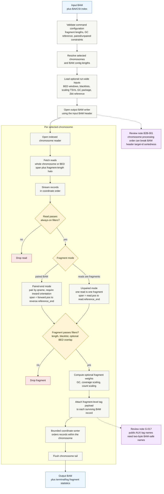

# `cfdna bam-to-bam` pipeline

Purpose: read an indexed coordinate-sorted BAM, apply cfDNAlab fragment filters and optional correction weights, and write a BAM containing the surviving original records with fragment-level AUX metadata.

## Flow

## Notes

`bam-to-bam` keeps the original BAM records, flags, CIGARs, sequences, qualities, and mate fields for surviving fragments. Paired-end fragments write both mates; unpaired `--reads-are-fragments` mode writes the single read.

The command currently preserves the input BAM header while choosing its own chromosome processing order. Review finding B2B-001 tracks the resulting coordinate-sort risk.

The documented multi-character AUX tag names are under review in G-017. BAM AUX tag keys are two bytes, so the public tag vocabulary needs to be made explicit before release.
