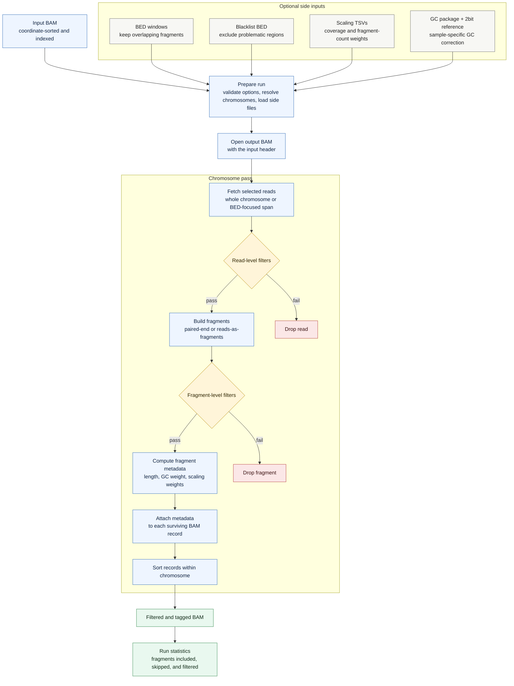

# `cfdna bam-to-bam`

Apply cfDNAlab fragment filters and optional correction weights to an existing BAM file. The command writes the surviving original BAM records with fragment-level metadata attached as AUX tags.

## Pipeline

## What Is Preserved

For each surviving fragment, `bam-to-bam` writes the original BAM record or records. It preserves flags, CIGARs, sequences, qualities, mate fields, and read names.

## What Is Added

Each surviving record receives the fragment length. When requested, records also receive GC correction weights, coverage-scaling weights, and fragment-count-scaling weights. Paired-end fragments write the same fragment-level metadata to both mates. Unpaired `--reads-are-fragments` mode writes one record per fragment.
